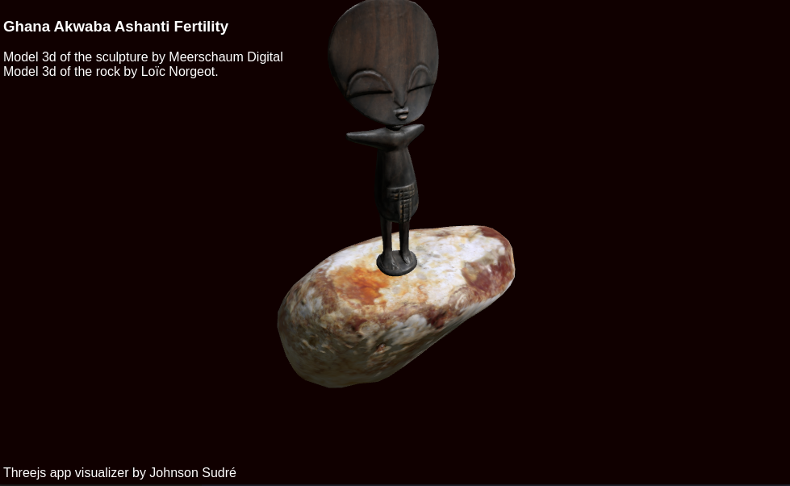

# Akwaba Ashanti Fertility viewer
A simple 3d viewer for study.



## Getting Started

### Dependencies

* Threejs

### devDependencies
* Vite

### Installing

* Clone this repo
* Enter in the project folder

### Executing program

* Installing the program
```
npm install
```
* Running the program
```
npm run dev
```

## Authors

Contributors names and contact info

Johnson Sudré  
[https://github.com/johnsonsudre](https://github.com/johnsonsudre)


## License

This project is licensed under the CC License


## Acknowledgments
* [Threejs](https://threejs.org/)
* [NikLever](https://github.com/NikLever)


## Thanks for the assets 
* [Meerschaum Digital](https://sketchfab.com/meerschaumdigital)
* [Loïc Norgeot](https://sketchfab.com/norgeotloic)
